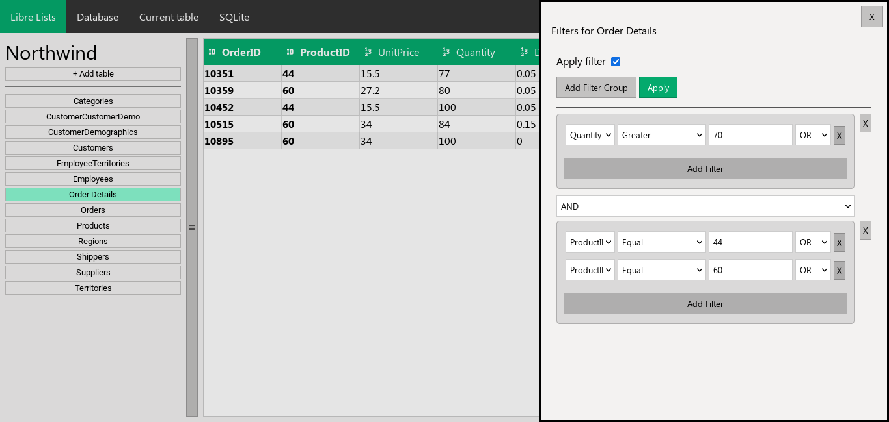

<div align="center">
  
  <h1>Libre Lists</h1>
  <p>Minimalistic Free and Open Source alternative to Microsoft Lists written in Python and Flask.</p>
</div>
<hr>

Create simple SQLite databases with Libre Lists, then use them in your [Other Apps](https://github.com/AdrBog/OtherApps) applications.

## Features
- [x] No Ads
- [x] No Tracking
- [x] Lightweight
- [x] No account needed
- [x] Self-hosting
- [x] Responsive UI
- [x] Unrestricted databases sizes
- [x] Themes
- [x] Addons

## Installation
Easily install Libre Lists on your server

You need to have Python with virtualenv and Git installed

Install flask-cors to avoid CORS issues when connecting Other Apps with Libre Lists

```bash
git clone https://github.com/AdrBog/LibreLists.git
cd LibreLists
python -m venv venv
source venv/bin/activate
pip install flask flask-cors python-magic
python -m flask run -p 5001
```
## Documentation
Future documentation will be added using pydoc
You can view the documentation using **pdoc**
```bash
pdoc app.py
```

## Screenshots




## License

Libre Lists

Minimalistic Free and Open Source alternative to Microsoft Lists written in Python and Flask. 

Copyright (C) 2023 Adrian Bogdan and contributors

This program is free software: you can redistribute it and/or modify
it under the terms of the GNU General Public License as published by
the Free Software Foundation, either version 3 of the License, or
(at your option) any later version.

This program is distributed in the hope that it will be useful,
but WITHOUT ANY WARRANTY; without even the implied warranty of
MERCHANTABILITY or FITNESS FOR A PARTICULAR PURPOSE.  See the
GNU General Public License for more details.

You should have received a copy of the GNU General Public License
along with this program.  If not, see <https://www.gnu.org/licenses/>.
