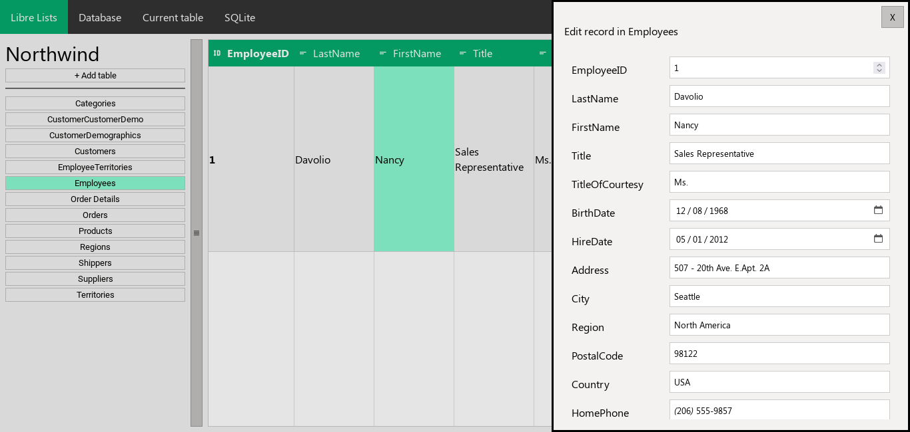

<div align="center">
  
  <h1>Libre Lists</h1>
  <p>Minimalistic Free and Open Source alternative to Microsoft Lists written in Python and Flask.</p>
</div>
<hr>


Create simple SQLite databases with Libre Lists, then use them in your [Other Apps](https://github.com/AdrBog/OtherApps) applications.

## Installation
You need to have Python with virtualenv and Git installed

Install flask-cors to avoid CORS issues when connecting Other Apps with Libre Lists

```bash
git clone https://github.com/AdrBog/LibreLists.git
cd LibreLists
python -m venv venv
source venv/bin/activate
pip install flask flask-cors
python -m flask run -p 5001
```

## Screenshots



